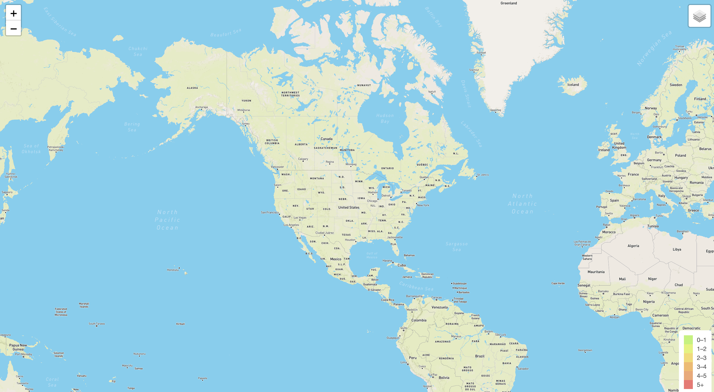
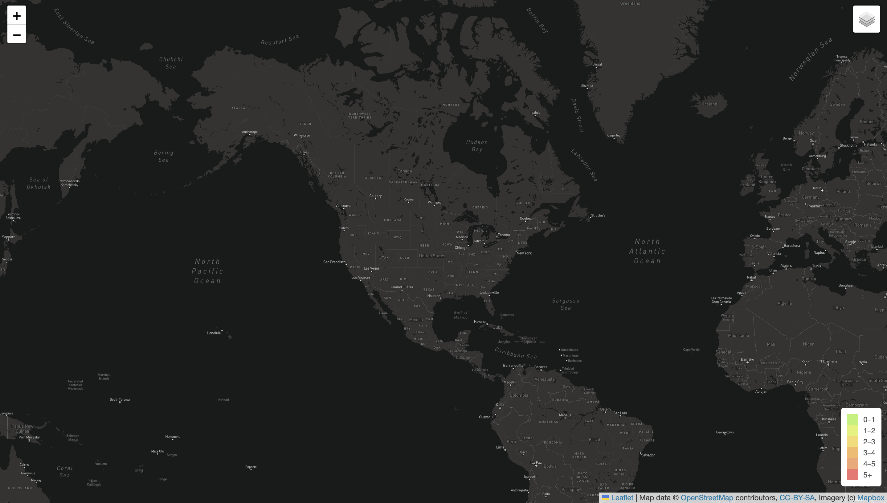
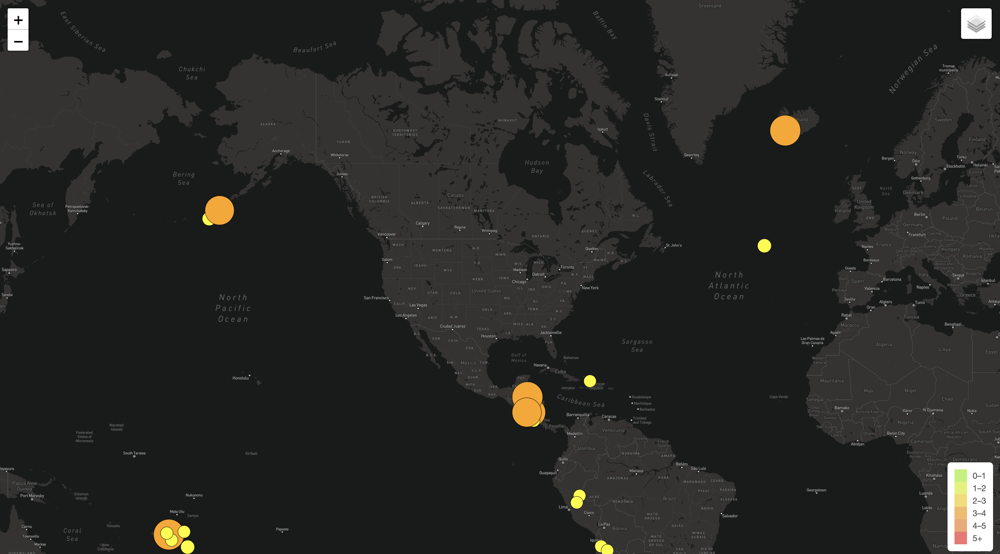

# Mapping_Earthquakes

## Overview

The Disaster Reporting Network is an agency that reports natural disaster information from around the world.  This project will include an interactive map to visualize the latest earthquakes around the world.  The  Disaster Response team at Disaster Reporting Network will able to use this data to respond to the most severe earthquakes around the world. 

## Resources

Data:

- earthquake.usgs.gov: https://earthquake.usgs.gov/earthquakes/feed/v1.0/summary/all_week.geojson
- earthquake.usgs.gov: https://earthquake.usgs.gov/earthquakes/feed/v1.0/summary/4.5_week.geojson
- github user content: https://raw.githubusercontent.com/fraxen/tectonicplates/master/GeoJSON/PB2002_boundaries.json

Software/Languages:

- Javascript
- HTML
- CSS
- Leaflet
- Mapbox

## Maps

### Base Maps

The visualization is a 3-layer, interactive base map of the globe, with 3 additional map overlays specific to a set of data and logic.  The range of maps provide usual depths of visualization based on need, such as the need to visualize terrain in a certain area.

Maps include:

 - Street Map 
 

 - Satellite Map
 

 - Dark Map 
 

### Overlay Maps

The additional visualizations allow for features to be added or removed based on user preference and the data the user finds most helpful.  The three overlays visualize Earthquake Data with 24 hours, Major Earthquake Data with 24 Hours, and location of tectonic plates around the globe.

- Earthquakes
 
 
 - Major Earthquakes
 
 
 - Tectonic Plates
 

